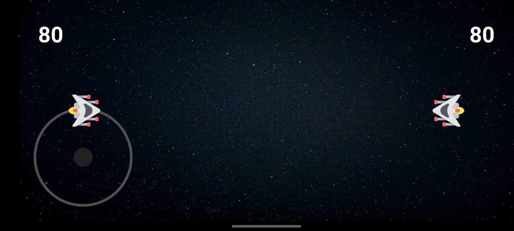
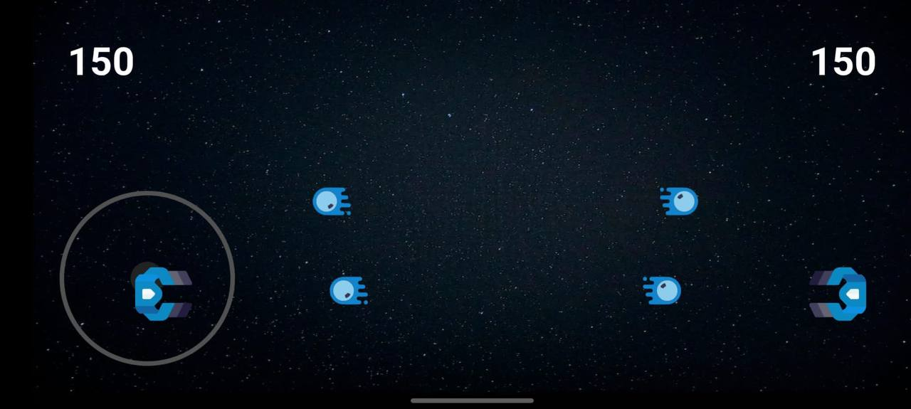
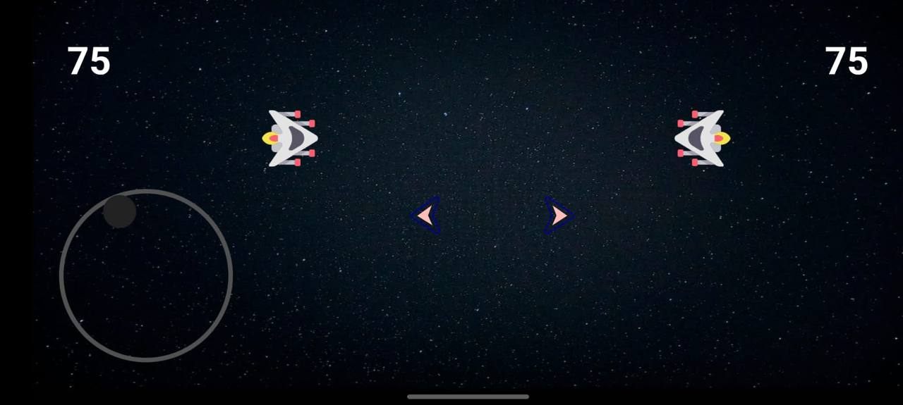
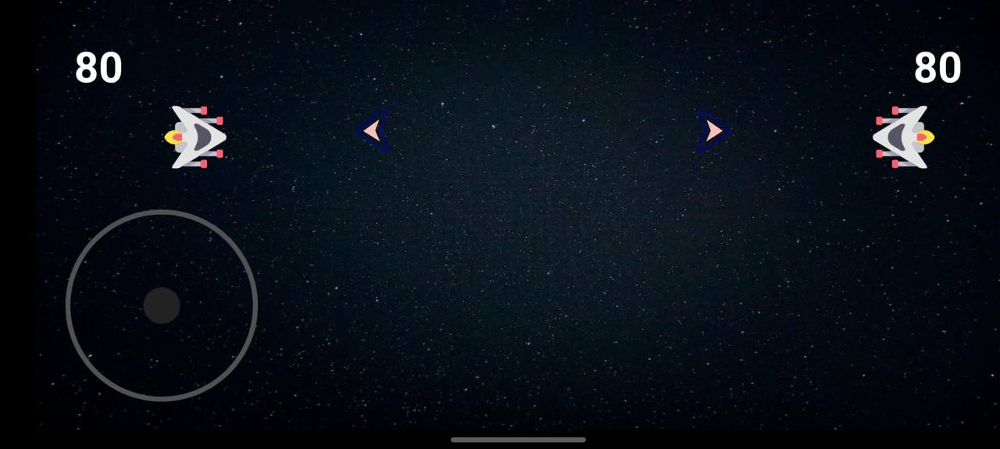

  

Kill-Shoot

  
  
  
  

Kill-Shoot is a 2D action game written entirely in android java.
## The aim of the game
Your goal is to kill the other person with bullets.
## How it works?
Using ImageView, the lead fired by the user is sent to the other side using animation. In the meantime, there is a collision detector that checks the x-y position every 20 ms. The detectors automatically detect according to the position of the user and the lead using Rect. If caught, he drops the life and deletes the image from the pool.
## Knowledge
This program was made for the project assignment of the course "Object Oriented Programs".
